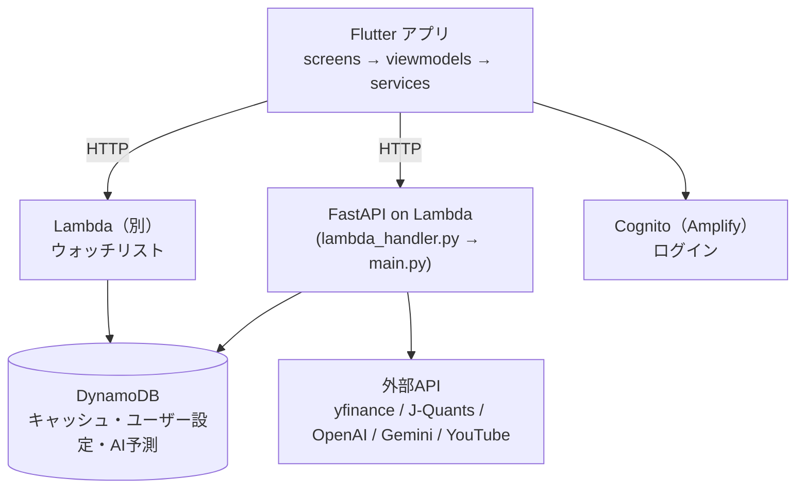

# 基本設計（アーキテクチャ）

stock_app の「どこに何を書くか」の決まり。**新しいファイル・関数・APIを足す前に読む。**

- 書き方（名前・コメント・エラー処理など）は [CODING_RULES.md](CODING_RULES.md)
- 画面ごとの仕様・API の詳しい仕様・改修の経緯は、オーナーの設計メモ（リポジトリ外）で管理している。このファイルには「コードを書くときに守る構造」だけを書く

---

## 1. 全体構成



| 部分 | 場所 | 補足 |
|---|---|---|
| アプリ | `lib/` | Flutter（Android / iOS / Web） |
| バックエンド | `backend/` | FastAPI を Mangum で Lambda 用に変換。コンテナイメージ（`backend/Dockerfile`） |
| 接続先URL | `lib/config/constants.dart` | 変えたらアプリのビルド番号を上げてリリースが必要 |

---

## 2. バックエンドの層

```
main.py          起動・APIクライアントの用意・ルーターの登録だけ
  │ （APIキーやクライアントを各ルーターに注入している）
  ▼
routers/         APIの受け口。リクエストを受けて services を呼び、レスポンスを返す
  ▼
services/        処理の本体（計算・外部APIの呼び出し・DynamoDB の読み書き）
  ▼
config/          設定値・定数（タイムアウト、お知らせ、日程など）。処理は書かない
```

| フォルダ | 書くもの | 書かないもの |
|---|---|---|
| `main.py` | アプリの初期化、ルーターの登録、APIキーの読み込み | 業務ロジック |
| `routers/` | エンドポイントの定義、入力チェック、レスポンスの形を整える | 長い計算・複数のAPIから使う処理 |
| `services/` | 指標の計算、プロンプト作成、キャッシュ、予測の記録など | FastAPI に依存する処理（`Request` など） |
| `config/` | 定数・設定値・定期的に更新するデータ | 関数・処理 |
| `tests/` | pytest | 外部APIに本当にアクセスするテスト |

**現状と新しく書くときのルール**：今の `routers/stock.py` や `routers/ai.py` には処理の本体も多く入っている。既存部分はそのままでよいが、**新しく書く処理で「2つ以上のルーターから使う」「30行を超える計算」になるものは `services/` に置く。** 既存部分の移動はリファクタリングの別PRで行う（[CODING_RULES.md](CODING_RULES.md) 6章）。

### ルーター一覧

| ファイル | 役割 | 主なパス |
|---|---|---|
| `stock.py` | 銘柄の検索・株価・詳細・イベント | `/search` `/stock/name` `/stock/price` `/stock/quotes`（ウォッチリスト用のまとめ取得） `/stock/detail` `/stock/events` |
| `market.py` | 市場全体（イベント・セクター騰落・日経・騰落レシオ） | `/market/*` `/nikkei/monthly` |
| `ai.py` | AI分析（スイング分析・相談・一括診断） | `/stock/swing_analysis` `/stock/consult` `/stock/ai_analysis` `/portfolio/diagnosis` |
| `stats.py` | AI予測の成績・答え合わせ | `/stats/*` |
| `user.py` | ユーザーのプロファイル | `/user/profile` |
| `youtube.py` | YouTube チャンネル・動画要約 | `/channels/*` `/summaries` `/summarize` |
| `notices.py` | アプリ内のお知らせ | `/notices` |

新しいAPIは、役割の合うルーターに足す。どれにも合わない場合だけ新しいルーターを作り、`main.py` で登録する。

---

## 3. 共通部品（必ずこれを使う）

**同じことをする処理を新しく書かない。** 下にあるものは必ずこれを使う。新しく共通部品を作ったら、この表に追記する。

| やりたいこと | 使うもの | 理由（使わないとどうなるか） |
|---|---|---|
| 現在の日時・今日の日付 | `services/clock.py` の `now_jst()` / `today_jst()` / `JST` | Lambda は UTC。日本時間 0:00〜8:59 が「前日」になる |
| 東証の営業日・権利落ち日 | `services/tse_calendar.py` の `is_tse_business_day()` / `month_end_rights_dates()` | 土日だけで数えると、祝日・年末（12/31〜1/3）の休場で日付がずれる。exchange_calendars の東証カレンダーは約1年先までしか計算できない |
| 外部APIのタイムアウト値 | `config/timeouts.py` | 未指定だと無限に待ち、Lambda の15分制限で落ちる |
| 日本株の決算発表予定日 | まず yfinance の `calendar`（`services/market_data.first_earnings_date()`）。取れなければ `services/jp_earnings.py` の `get_jp_earnings_dates()`（J-Quants `/v2/fins/earnings-date`。12時間保存。**無料プランは「12週間前〜」のデータしか見られず、これからの決算日はほぼ取れない**） | V1 の名前（`/fins/announcement`）を V2 で呼ぶと存在せず、決算日が一度も出なかった（K-47）。J-Quants の無料プランは1分5回まで。**J-Quants の API を足すときは、V2 の移行表（https://jpx-jquants.com/ja/spec/migration-v1-v2）で名前を確かめる** |
| 日本株かどうかの判定・銘柄コードの変換 | `services/stock_code.py` の `is_jp_code()` / `to_yf_ticker()` / `to_jquants_code()`（アプリは `lib/utils/stock_code.dart` の `StockCode`） | `isdigit()` や `^\d{5}$` で判定すると、英字入りのコード（285A など）を米国株として扱ってしまう |
| yfinance の結果の後始末 | `services/market_data.py` の `drop_empty_rows()` | 日本株は最新日が空の行で返り、株価・指標が全部 null になる |
| 配当利回り | `services/market_data.py` の `dividend_yield_pct()`（%で返す。年間配当額 ÷ 株価） | yfinance の `dividendYield` は版によって単位（割合／%）が変わる。×100 すると「344%」になる（K-46）。詳細APIはアプリに合わせて割合で返す |
| 52週の高値・安値 | `services/market_data.py` の `week52_range()`（yfinance の `fiftyTwoWeekHigh/Low` を優先） | 手元の期間（3か月・6か月）の高値・安値を「52週」として出してしまう（K-50） |
| DynamoDB のキャッシュ | `services/cache.py` の `cache_get()` / `cache_set()` | 期限切れの判定・Decimal 変換を毎回書くことになる |
| 銘柄マスタ（全上場銘柄の名前一覧）の用意 | `services/stocks_master.py` の `prepare_stocks_master()`（DynamoDB に1日保存したものを先に読み、無いときだけ J-Quants から取る。ページ送りも読む） | 起動のたびに J-Quants へ取りに行くと、同時に何台も起動したときに一部の台で失敗し、銘柄名がコードのまま・`/health` が J-Quants エラーになる |
| AI系のエラーレスポンス | `routers/ai.py` の `classify_error()` / `error_response()` | アプリがエラーを結果として扱ってしまう |
| OpenAI で JSON を受け取る | `routers/ai.py` の `call_openai_json()` | 途中で切れた JSON（`max_tokens` 切れ）を検出できない |
| OpenAI のモデル名 | `config/ai_models.py` の `OPENAI_ANALYSIS_MODEL`（分析）/ `OPENAI_LIGHT_MODEL`（翻訳・相談）と考える量 `OPENAI_ANALYSIS_EFFORT` / `OPENAI_LIGHT_EFFORT` | 直書きすると、変えるときに漏れる |
| OpenAI の出力上限・考える量 | `services/openai_params.py` の `openai_limit_params()` | 考えるモデル（GPT-5/6系）に `max_tokens` を送ると400エラー。思考の分を足さないと答えが空になる |
| AI予測の記録・答え合わせ | `services/predictions.py` | 的中率の集計がずれる |
| お知らせ | `config/notices.py` の `NOTICES`（version を +1） | — |
| ログインのトークン確認 | `services/auth.py` の `verify_request_token()`（`main.py` のミドルウェアで全リクエストに実行し、結果は `request.state.auth`）。設定は `config/auth.py` | 自分で JWT を読むと、署名・期限・発行元・client_id の確認漏れが起きる |
| （アプリ）エラーの表示 | `lib/widgets/error_dialog.dart` / `api_error_banner.dart` | 失敗しても何も出ない画面になる |
| （アプリ）ログイン状態の確認 | `AuthService.hasValidSession()` / `lib/services/session_guard.dart` | `isSignedIn` は期限切れでも true のまま |
| （アプリ）表示用の整形 | `lib/utils/formatter.dart` | 数字・日付の表示がばらつく |
| （アプリ）バックエンド・Lambda への通信 | `lib/services/api_client.dart` の `ApiClient.get` / `ApiClient.post`（`http.get` / `http.post` を直接呼ばない） | ログインのトークン（Authorization ヘッダー）が付かず、バックエンドで本人確認できない（段階2以降は拒否される） |
| （アプリ）通信の待ち時間 | `lib/config/timeouts.dart` の `AppTimeouts.api`（40秒）／`AppTimeouts.ai`（120秒）。`StockService.aiTimeout` は `AppTimeouts.ai` の別名 | 付けないと、サーバーが応答しないときに読み込み中のまま止まる（最悪 Lambda の15分）。バックエンドのタイムアウトより長くしないと、バックエンドのエラーを受け取れない |

---

## 4. アプリ（Flutter）の層

```
screens/      画面（見た目と、ユーザー操作の受け取り）
  ▼
viewmodels/   画面の状態とロジック（ChangeNotifier + Provider）
  ▼
services/     通信・保存（バックエンドAPI、ウォッチリスト、認証、プロファイル）
  ▼
models/       データの型（Stock など）
```

| フォルダ | 書くもの |
|---|---|
| `screens/` | 画面。1画面1ファイル（`xxx_screen.dart`） |
| `viewmodels/` | 状態（読み込み中・データ・エラー）とロジック。`notifyListeners()` で画面を更新 |
| `services/` | HTTP 通信など外とのやり取り。今は `static` メソッドのクラス（例：`StockService.getPrice`） |
| `widgets/` | 複数の画面で使う部品、または大きい画面から切り出した部品 |
| `config/` | 定数（URL、イベント種別、リリースノート） |
| `models/` | データの型 |
| `utils/` | 表示用の整形などの小さな関数 |
| `theme/` | 色・文字などの見た目の設定 |

**現状と新しく書くときのルール**：ViewModel があるのは `home` / `detail` / `portfolio` だけで、他の画面は StatefulWidget が直接 service を呼んでいる。既存はそのままでよいが、
- **画面から直接 `http` を呼ばない。** 通信は必ず `services/` に書く
- 状態が複雑な画面（読み込み・エラー・複数のAPI）を新しく作るときは ViewModel を作り、`main.dart` の `MultiProvider` に登録する

### 大きいファイルの扱い

`detail_screen.dart`（3700行超）・`portfolio_screen.dart`・`schedule_screen.dart` は大きすぎて、変更がぶつかりやすい。

- 機能を足すときは、新しい部分を `lib/widgets/`（その画面だけで使うなら `lib/widgets/detail/` などのサブフォルダ）に別ファイルで作り、画面からは呼び出すだけにする
- 既存部分の分割は、開いているPRが少ないときに `chore/refactor-…` の別PRで行う

---

## 5. データ（DynamoDB）

| テーブル | 中身 | 期限 |
|---|---|---|
| `market_cache` | 市場全体のキャッシュ | `cache_set` の `ttl_minutes` |
| `stock_cache` | 銘柄ごとのキャッシュ | 同上 |
| `user_profiles` | ユーザーのプロファイル（投資スタイル等） | なし |
| `ai_predictions` | AI予測の記録（的中率の測定用） | なし（キャッシュではない） |
| `stock_favorites` | ウォッチリスト（別の Lambda が読み書き） | なし |

- テーブルの取得は `services/cache.py` にまとめている。新しいテーブルもここに足す
- キャッシュの中身の形を変えたら、キャッシュキーの版を上げる（`xxx` → `xxx_v2`）

---

## 6. 「ここを変えたら、ここも直す」

| 変えるもの | 一緒に直す場所 |
|---|---|
| AIの優先順位の既定値 | `services/technical.py` の `DEFAULT_PRIORITY` ⇔ `lib/screens/profile_setup_screen.dart` の既定値 |
| プロンプト | `services/technical.py` の `PROMPT_VERSION` を上げる |
| セクターETFの名前 | `routers/market.py` の `JP_SECTOR_ETFS` / `US_SECTOR_ETFS`（日本は JPX の ETF 一覧の「TOPIX-17 ○○」の名前）⇔ `services/technical.py` の `SECTOR_EN_TO_JP` / `SECTOR_EN_TO_US` / `INDUSTRY_KEYWORD_TO_JP` ⇔ `lib/screens/market_screen.dart` の説明文。名前を変えたら `/market/sectors` のキャッシュキーの版を上げる（`tests/test_sector_names.py` が対応表の名前の食い違いを検出する） |
| イベントの type を追加 | `routers/market.py` ⇔ `lib/config/event_types.dart`（グループに入れないとフィルタに出ない） |
| プロファイルの項目を追加 | `routers/user.py`（保存・既定値）⇔ `UserProfileService` ⇔ `ProfileSetupScreen` ⇔ `StockService.runSwingAnalysis`（送信）⇔ `routers/ai.py`（受信）⇔ `build_profile_section` |
| バックエンドのURL | `lib/config/constants.dart`（＋アプリのビルド番号を上げてリリース） |
| APIのレスポンスの形 | 呼び出し側の `lib/services/*.dart` ⇔ E2Eテスト（`stock-app-e2e`） |
| `/stock/name`・`/stock/price` の中身 | `/stock/quotes`（同じ関数を呼んでまとめて返している）⇔ `StockService.stockFromQuote`（表示用の整形を共有） |
| 画面の文言（ボタン名など） | E2Eの画面テスト（`stock-app-e2e`） |
| ユーザーに見える変更 | `config/notices.py` にお知らせを追加 |
| 依存ライブラリ | `requirements.txt` **と** `requirements-lambda.txt` |
| OpenAI のモデル | `config/ai_models.py`（考えるモデル⇔GPT-4o系を変えるときは `services/openai_params.py` の判定も確認）⇔ 料金・速さが変わるので `OPENAI_TIMEOUT_SEC` と `OPENAI_REASONING_TOKEN_BUDGET` を見直す |
| Flutter のバージョン | `.github/workflows/ci.yml` ⇔ `.github/workflows/preview.yml` ⇔ E2E の `e2e.yml`（`stock-app-e2e`） |
| `ci.yml` のジョブ名 | GitHub のルールセット「main を守る」の必須チェック（名前が合わないと全PRがマージ不可） |

新しく連動する箇所ができたら、この表に追記する。

---

## 7. Lambda で動くことによる制約

- 書き込めるのは `/tmp` だけ（`Dockerfile` で `HOME` とキャッシュ先を `/tmp` にしている）
- タイムゾーンは UTC（→ `services/clock.py`）
- 最大15分で強制終了（→ `config/timeouts.py`）
- モジュール変数（`stocks_master` など）はコンテナが生きている間だけ残る。毎回あるとは限らない前提で書く
- 起動時の処理（`main.py` の startup）はコールドスタートのたびに走る。重い処理を足さない
- アプリが同時に何件も問い合わせると、Lambda が何台も同時に起動する。起動時に外部APIへ取りに行くものは DynamoDB に保存して共有する（例：銘柄マスタ）。また、アカウントの同時実行数の上限を超えた分は `ConcurrentInvocationLimitExceeded` で断られる
